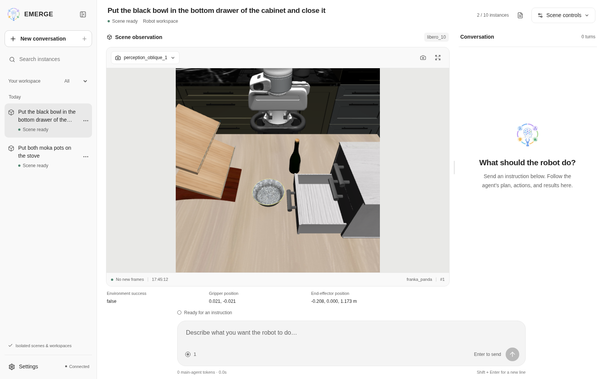
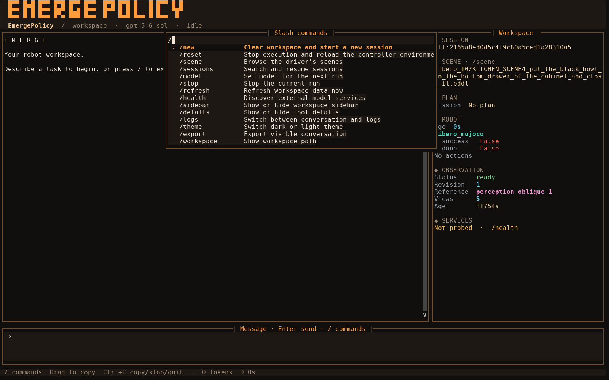

<div align="center">

# EMERGE-Policy

### A Robot Mind Emerges Beyond a Single Policy

Zhirui Fang<sup>&#42;</sup>, Qingchi Yu<sup>&#42;†</sup>, Ziyang Chen<sup>&#42;</sup>, Longfei Li<sup>&#42;†</sup><br>
Haoran Ma<sup>†</sup>, Keru Zhou, Xinrun Xu, Samith Va, Yuxuan Hu<sup>†</sup>, Peixuan Song, Qiang Du<br>
Bin Qian, Yongkang Deng<sup>†</sup>, Xin Li<sup>†</sup>, Yezhen Wang, Zhe Li, Hao Luo<br>
Shuyan Li, Ziwei Wang, Weijian Deng, Xiu Li<sup>✉</sup>

Tsinghua University · Nanjing University of Science and Technology · Xi'an Jiaotong University · Xidian University · Harbin Institute of Technology · Peking University · Nanyang Technological University

<sup>&#42;</sup> Equal contribution &nbsp;&nbsp; <sup>†</sup> Work done during internship at Tsinghua University &nbsp;&nbsp; <sup>✉</sup> Corresponding author

[](https://emerge-policy.github.io/EMERGE-Policy/)
[](https://arxiv.org/pdf/2608.29896)
[](https://arxiv.org/abs/2608.29896)
[](https://github.com/EMERGE-Policy/EMERGE-Policy)

</div>

<p align="center">
  
</p>

<table align="center" width="100%">
  <tr>
    <td align="center">
      <br>
      <h3> &nbsp; ❝ Thinking outside the brain means skillfully engaging entities external to our heads. ❞ &nbsp; </h3>
      <p><strong>— Annie Murphy Paul, <em>The Extended Mind</em></strong></p>
      <br>
    </td>
  </tr>
</table>

##  What's New

-  **[October 1, 2026]** We release EMERGE-Policy v1.0.0 with a new Web console!
  Run `emerge web` to manage robot tasks from the browser with live camera views,
  conversation and task progress, searchable scene selection, and reset and switch
  controls. Each conversation has an isolated scene and workspace, keeping controller
  state and artifacts separate while making parallel experiments easier to organize.
  Guided first-run setup further lowers the setup and day-to-day operation overhead.

-  **[September 24, 2026]** EMERGE-Policy now supports environment reset and scene
  switching directly from the TUI! Use `/reset` to reload the environment or
  `/scene` to browse and select a new scene. A unified driver lifecycle interface
  brings reset and scene selection to new environment integrations, with updated
  BDDL configuration and LIBERO evaluation support.

-  **[September 16, 2026]** We release the WAM version of EMERGE-Policy! This new
  version integrates Cosmos Policy WAM alongside the original OpenPI VLA version,
  with isolated model servers, multi-worker batched inference, and evaluation on
  standard LIBERO and LIBERO-Plus. LIBERO-Pro evaluation currently remains on the
  VLA version.

-  **[September 7, 2026]** We release the new EMERGE-Policy CLI! The new `emerge`
  command provides a simpler, unified entrypoint for launching and interacting
  with the embodied agent.

-  **[August 30, 2026]** The first version of EMERGE-Policy is now available! This
  initial release introduces an embodied control framework in which a primary agent
  coordinates planning while multiple sub-agents collaborate on perception and
  verification. It also establishes the first end-to-end closed-loop execution
  pipeline, marking the project's first step from a single policy toward
  multi-policy collaboration and continual evolution.


## Overview


Embodied-intelligence research has traditionally pursued a single end-to-end
model. Long-horizon tasks, however, require frequent low-level perception,
context-intensive high-level planning, and fine-grained action generation. These
competing workloads are difficult to reconcile within one model and can lead to
confused reasoning, accumulated errors, and eventual task failure.

**EMERGE-Policy introduces a new embodied-intelligence system paradigm.**
Intelligence is not confined to any individual model. Instead, a graph-structured
agent orchestrates tasks asynchronously and concurrently, invoking specialized
models as tools for perception, planning, action, and verification. System-level
intelligence thereby **emerges** through the coordinated interaction of multiple
components.

This architecture mirrors how humans exercise intelligence while interacting
with the world: our eyes perceive the environment, our hands perform physical
skills, and our brains plan and imagine. Different heterogeneous organs contribute
different capabilities, while coherent intelligence arises from their
collaboration.

## Two Ways to Interact

<p align="center">
  <strong>One agent runtime, two ways to work.</strong><br>
  <sub>Both interfaces share the same planning, robot control, and observation tools.</sub>
</p>

<table>
  <tr>
    <td width="50%" valign="top" align="center">
      <h3>Web Interface</h3>
      <sup><strong>RECOMMENDED</strong></sup><br><br>
      <a href="fig/web.png">
        
      </a>
      <br><br>
      <strong>Visual workspace for daily operation</strong><br>
      <sub>Live camera views · Isolated scenes · Conversation and task progress</sub>
      <br><br>
      <code>emerge web</code>
    </td>
    <td width="50%" valign="top" align="center">
      <h3>Terminal Interface</h3>
      <sup><strong>TUI</strong></sup><br><br>
      <a href="fig/tui.png">
        
      </a>
      <br><br>
      <strong>Focused control without leaving the terminal</strong><br>
      <sub>Conversations · Plan and robot state · Scene and reset commands</sub>
      <br><br>
      <code>emerge</code>
    </td>
  </tr>
</table>

## Installation

### 1. Clone the Repository

```bash
git clone --recurse-submodules \
  https://github.com/EMERGE-Policy/EMERGE-Policy.git
cd Emerge-Policy

git submodule sync --recursive
git submodule update --init --recursive
```

### 2. Install the LIBERO-Plus Assets

The LIBERO-Plus Git checkout does not include its large asset bundle. Download
`assets.zip` from the official
[Sylvest/LIBERO-plus Hugging Face dataset](https://huggingface.co/datasets/Sylvest/LIBERO-plus)
and extract it into the checked-out submodule:

```bash
conda activate base
python -m pip install --upgrade huggingface_hub
hf download Sylvest/LIBERO-plus assets.zip \
  --repo-type dataset \
  --local-dir /tmp/libero-plus-assets
unzip -q /tmp/libero-plus-assets/assets.zip \
  -d third_party/libero_plus/libero/libero
```

### 3. Install the Main `EmergePolicy` Environment

```bash
conda create -n EmergePolicy python=3.12 -y
conda activate EmergePolicy
python -m pip install --upgrade pip wheel "setuptools<82"

python -m pip install \
  -e ".[libero,web]" \
  -e third_party/vggt \
  -e third_party/sam3 \
  -e third_party/openpi/packages/openpi-client

bash third_party/imagemagick_env/install.sh
```

Build the Web interface (requires Node.js 22.12+):

```bash
npm --prefix web install
npm --prefix web run build
```

### 4. Install the Standalone OpenPI Environment `pi05_server`

pi05 Policy runs in its own Conda environment; do not install its server
dependencies into `EmergePolicy`.

```bash
conda create -n pi05_server python=3.12 -y
conda activate pi05_server
python -m pip install --upgrade pip uv

cd third_party/openpi
GIT_LFS_SKIP_SMUDGE=1 uv pip install \
  --python "$CONDA_PREFIX/bin/python" \
  -e .
cd ../..
```

### 5. Install the Standalone Cosmos Policy Environment `cosmos-policy`

Cosmos Policy runs in its own Conda environment; do not install its server
dependencies into `EmergePolicy`.

```bash
conda create -n cosmos-policy python=3.10 -y
conda activate cosmos-policy
python -m pip install --upgrade pip uv

cd third_party/cosmos-policy
uv pip install \
  --python "$CONDA_PREFIX/bin/python" \
  -e ".[cu128]" \
  --group libero \
  "websockets>=16,<17" \
  "msgpack>=1.1,<2"
cd ../..
```

## Quick Start

Run from the repository root with `conda activate EmergePolicy`. Start the model
services, then choose **Web (recommended)**, **TUI**, or **Headless** below.

### Start Model Services


For OpenPI VLA:

```bash
OPENPI_GPU=0 \
VGGT_GPU=1 \
SAM3_GPU=2 \
bash scripts/model_server/start_external_model_servers.sh --services openpi,vggt,sam3
```

For the Cosmos Policy WAM backend:

```bash
WAM_GPU=0 \
VGGT_GPU=1 \
SAM3_GPU=2 \
bash scripts/model_server/start_external_model_servers.sh --services cosmos,vggt,sam3
```

### Web (Recommended)

```bash
emerge web
```

Open **http://127.0.0.1:8080/**. The first launch guides you through API setup.
Create a conversation to start a scene; Web manages its Controller and isolated
workspace automatically. See the [Web guide](web/README.md) for more options.

### TUI

Start the Controller in one terminal:

```bash
python -m robot.controller \
  --driver libero_mujoco \
  --driver-config dev/libero_mujoco_driver_sample.json
```

Launch the terminal interface in another terminal. The first launch guides you
through API setup:

```bash
emerge
```

### Headless

For scripts and evaluations, configure your API through Web or TUI first, then
start the Controller as above and run a single task:

```bash
python -m Emerge.cli.headless "Put the red block in the basket"
```

The result is written to stdout as JSON. TUI and Headless use
`~/.Emerge/workspace` by default. See the [headless guide](Emerge/README.md#headless-runtime)
for request files and runtime options.

## Model Checkpoints

Download the external model checkpoints to `checkpoints/` in the repository root:

| Model | Source and Contents | Destination |
|---|---|---|
| OpenPI π0.5-LIBERO | Fetch `gs://openpi-assets/checkpoints/pi05_libero` from the [official OpenPI checkpoint repository](https://github.com/Physical-Intelligence/openpi#model-checkpoints) | `checkpoints/pi05_libero/` |
| VGGT-1B | Download `model.pt` from [`facebook/VGGT-1B`](https://huggingface.co/facebook/VGGT-1B) | `checkpoints/vggt/model.pt` |
| SAM3 | Download `sam3.pt` from [`facebook/sam3`](https://www.modelscope.cn/models/facebook/sam3/files) on ModelScope | Rename it to `checkpoints/sam3/model.pt` |
| Cosmos Policy (optional) | Download the policy weights, statistics, and T5 cache from [`nvidia/Cosmos-Policy-LIBERO-Predict2-2B`](https://huggingface.co/nvidia/Cosmos-Policy-LIBERO-Predict2-2B) | `checkpoints/cosmos-policy/` |
| Cosmos Predict2 (optional) | Download the base model from [`nvidia/Cosmos-Predict2-2B-Video2World`](https://huggingface.co/nvidia/Cosmos-Predict2-2B-Video2World) | `checkpoints/cosmos-policy/Cosmos-Predict2-2B-Video2World/` |

## External Model Service Ports

The startup script launches the selected persistent services, keeping model
loading independent from individual agent episodes.

| Service | Port | Environment | Purpose |
|---|---:|---|---|
| OpenPI | 8000 | `pi05_server` | VLA policy inference through the shared runtime |
| VGGT | 8001 | `EmergePolicy` | Multi-view geometry estimation |
| SAM3 | 8002 | `EmergePolicy` | Prompt-guided image segmentation |
| Cosmos Policy | 8003 | `cosmos-policy` | WAM candidate action generation and scoring |

For additional startup options and health-check endpoints, see
[`scripts/model_server/README.md`](scripts/model_server/README.md).

## Evaluation

- [Standard LIBERO Evaluation](scripts/Libero_eval/README.md)
- [LIBERO-Plus Robustness Evaluation](scripts/LiberoPlus_eval/README.md)
- [LIBERO-Pro Evaluation](scripts/LiberoPro_eval/README.md)
